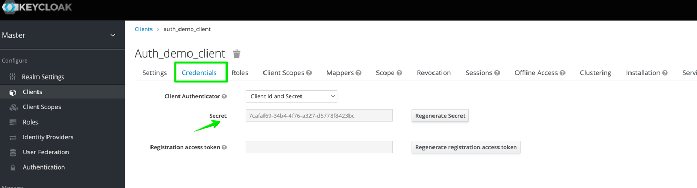
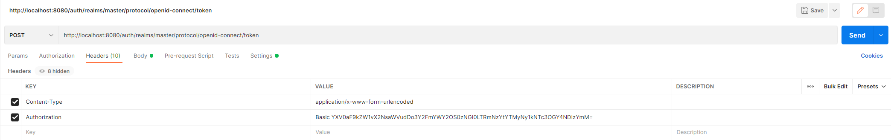
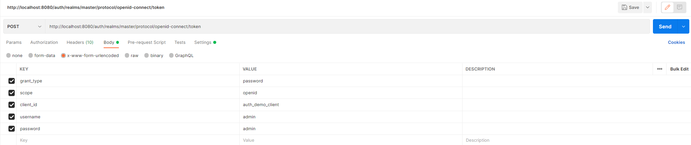
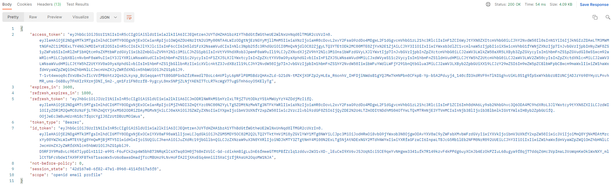
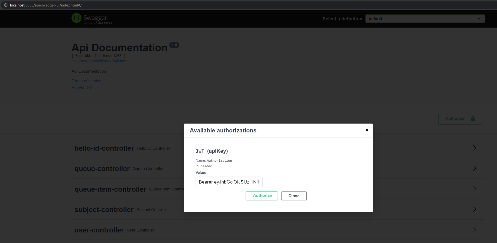
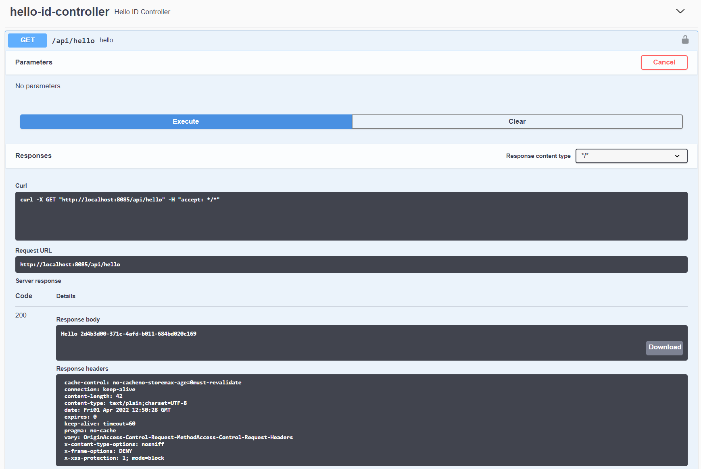

## Setup Keycloak as authorization server

1. Run Keycloak ```docker run --rm -p 8080:8080 -e KEYCLOAK_USER=admin -e KEYCLOAK_PASSWORD=admin jboss/keycloak:13.0.1```  
2. Open Keycloak server in the browser http://localhost:8080/auth. Then go to the ```Administration Console```. Use credentials provided with the command above.  
  
3. On the left menu, go to ```Clients``` and ```Create```.  
  
4. On the next screen, give ```Client ID``` and then save.  
  
5. Then, Access Type -> ```credentials```; Service Accounts Enabled -> ```ON```; Valid Redirect URIs -> ```some URL```; Web Origins -> ```*```.  
  
6. Under Advanced Settings set the ```Access Token Lifespan``` to your preferred length of time and ```Save```.  
  
7. Then, go to the ```Credentials``` tab and copy the client secret.  
  
8. Generate base64 encoded string from 'client_id:client_secret'. In this example the input is ```auth_demo_client:7cafaf69-34b4-4f76-a327-d5778f8423bc``` and the output becomes```YXV0aF9kZW1vX2NsaWVudDo3Y2FmYWY2OS0zNGI0LTRmNzYtYTMyNy1kNTc3OGY4NDIzYmM=```.  
9. In Postman in Headers set ```Authorization``` to 'Basic ' + your base64 encoded string. In this example: ```Basic bmV3UXNfY2xpZW50OjYxNzQ1NTYzLWVjZWItNGE0OS05ZThmLWQ4YTRiODJkMTllNw==```.  
  
10. In Body use the credentials of your Keycloak user and ```Send```.  
  
11. You should get back an ```access_token```.  
  

## Run Spring Boot REST API

1. Run ```mvn spring-boot:run -f pom.xml```.  
2. Open Swagger-UI in the browser http://localhost:8085/api/swagger-ui/index.html. Then go to ```Authorize```, enter 'Bearer ' + your access token and click ```Authorize``` and ```Close```.  
  
3. Expand ```hello-id-controller```, click ```Try it out``` and ```Execute```. In the response body you should get back 'Hello ' + your Keycloak user ID.  
  